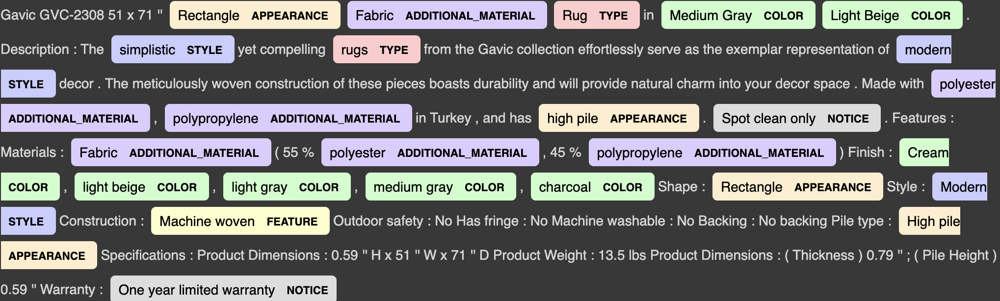
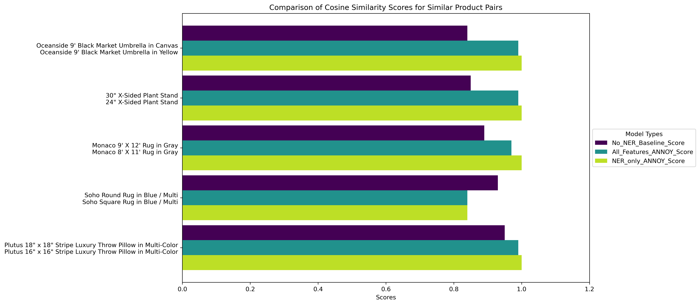
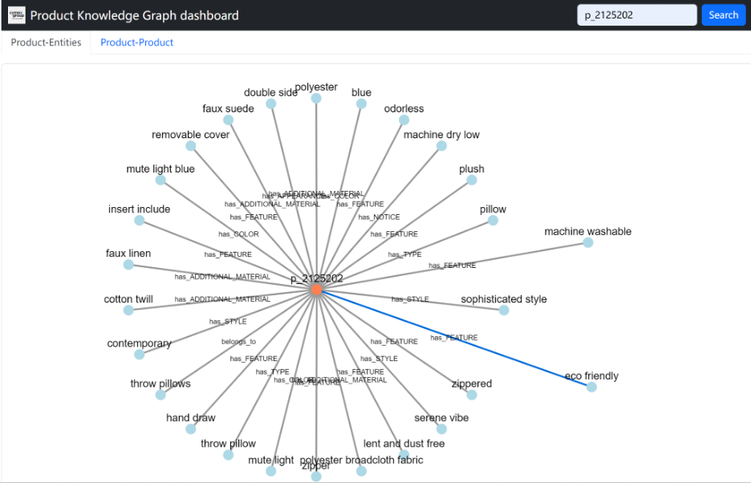
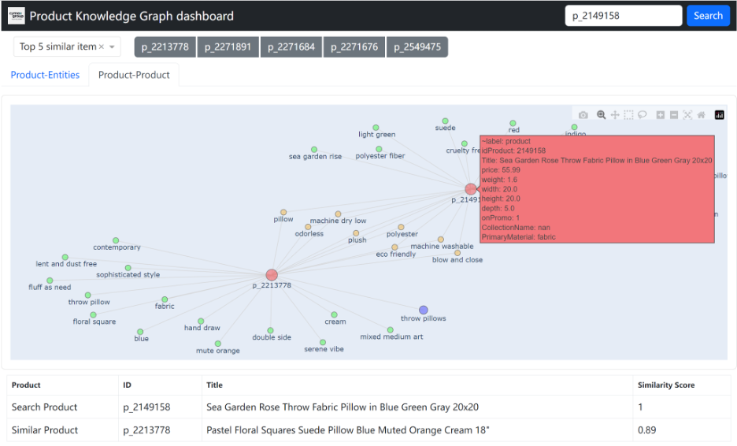
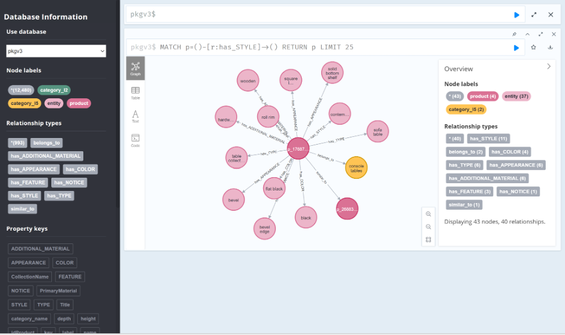

```{r setup, include=FALSE}
knitr::opts_chunk$set(echo = TRUE)
library(knitr)
```

## Executive summary


In our Capstone project, our aim was to help Cymax create a knowledge graph that enables the discovery of furniture items with similar characteristics or those that complement each other by analyzing product titles and descriptions. We tackled this problem through named-entity recognition (NER). Specifically, we developed a data science pipeline that performs several tasks. First, it extracts named entities from product descriptions using a fine-tuned NER model. Then, it determines similarities between entities based on these extracted named entities and other provided features. Finally, it facilitates the visualization of similar products through a proof-of-concept product knowledge graph dashboard. The resulting NER model achieved decent performance based on the entity F1 metric and human validation, and the extracted entities were used to establish more meaningful similarities. Utilizing our work in conjunction with other product analytics at Cymax will improve the overall customer experience and ensure that valuable insights are extracted from their text data.


## Introduction


Cymax Group Technologies is an eCommerce company that provides furniture vendors and retailers with a software-as-a-service platform. Within their extensive database, Cymax effectively manages a collection of over 600,000 furniture items, each accompanied by a range of distinctive features. Our team has access to diverse attributes associated with these items, such as pricing details, promotional status, dimensions, weight, as well as textual descriptions including product titles and comprehensive descriptions. Although their current platforms make use of these tabulated data associated with furniture items, valuable information within the textual descriptions remains untapped. By unlocking this untapped information, Cymax can gain deeper insights into their product catalog and improve the effectiveness and effectiveness of their search and recommendation systems.


This project was structured into three sequential milestones, each contributing to the development of the final data product for Cymax. The objectives we sought to answer were
- How can we extract meaningful attributes of each product from textual descriptions?
- Once we have these meaningful attributes, how can we use them to improve our ability to search for similar products and to what extent does including these attributes improve the search?
- How can we effectively visualize product-attribute relationships and product-product relatedness?


## Milestone 1 - Named-entity Recognition (NER) for Product-Entity


### Data science methods


Our goal is to extract meaningful attributes from product descriptions by excluding marketing phrases such as “timeless elegance” in order to facilitate the discovery of similar products. Meanwhile, we want to retain the semantic meaning of relevant attributes. Therefore, off-the-shelf models  like BERT SentenceTransformer, bag-of-words, or word2vec were not suitable on the entire text columns. From Walmart's product knowledge graph article [@Deivasigamani2020], we decided to leverage their methodology to extract these attributes to find product-entity relationships and use the custom Named-entity Recognition (NER) for entity extraction.


To address the custom NER task, we performed fine-tuning on the pre-trained BERT language model. In collaboration with our partner, we identified seven specific entities of interest: 'Color', 'Type', 'Additional Material', 'Appearance', 'Style', 'Feature', and 'Notice'. Since the raw dataset contains 258 unique product subcategories and 72 different general product types, one challenge is to have large enough sample size to cover most of the diverse product types.Therefore, we chose to have two annotators manually label 200 randomly selected product descriptions for these entities, following our [NER guideline](https://github.com/yukunzGIT/ubc_cymax_nlp_product_knowledge_graph/blob/main/docs/NER_annotation_guideline.docx). The following image shows one example of  manual annotation:


```{r figure_1, echo=FALSE, fig.align='center', out.width = '100%', fig.cap="Manual Annotation of Named Entities"}

```


To ensure consistency and reproducibility of  the annotation between annotators, we employed the Inter-annotator Agreement (IAA) metric to measure tagging variability. Existing IAA metrics like Cohen kappa or Fleiss' kappa score are based on two tags only and cannot be directly used. So we modified the cohen_kappa_score in scikit-learn [@scikit-learn] for multiple tags and annotators and created a new IAA score metric. The IAA score was 85.5%, which demonstrates a high level of agreement.


Once the annotation task is completed, we explore the modeling process. Since there are no pre-existing models for Cymax's case and building a new model from scratch is time-consuming with limited resources, we choose to fine-tune a large language model for custom NER on all products. We utilize four bidirectional models (bert-base-uncased, bert-large-uncased, dslim/bert-base-NER, Jean-Baptiste/roberta-large-ner-english) to capture contextual information from product descriptions. Our best model is determined based on an unseen validation set comprising additional 50 tagged examples. For measuring the model’s quality, we use the exact match F1 score as our supervised metric to match Cymax’s conservative needs to capture both precision and recall.


### Data product & results


Our NER process includes the following data deliverables:


-   NER annotation guideline (with examples)
-   IAA multi_cohen_kappa_score metric
-   Best fine-tuned NER model


The NER annotation guideline provided can be used by Cymax to annotate additional text examples, increasing training sample diversity and capturing more items for different product categories. It's important to note that the NER guideline may require updating and modification if Cymax expands its product range with new unseen furniture items.


If Cymax chooses to incorporate additional annotations or tags, it is advisable to regularly assess the IAA. If they have multiple annotators, they can perform a pairwise IAA based on our metric.


We evaluate our NER model performance using the metrics proposed in Message Understanding Conference 5 (MUC-5) [@chinchor-sundheim-1993-muc]. Here an entity tagged is marked as correct when it is able to assign the right tag to an entity, and if it finds the correct starting and ending entity boundaries. Based on the F1 score with exact match, the results for our 4 large language models are as follows:


```{r table_1, echo=FALSE, tab.align='center'}


data <- data.frame(
  Models = c("bert-base-uncased", "bert-large-uncased", "Jean-Baptiste/roberta-large-ner-english", "dslim/bert-base-NER"),
  Runtime = c("28 min", "72 min", "40 min", "35 min"),
  Test_F1_score = c(0.76, 0.77, 0.76, 0.74),
  Unseen_validation_F1_score = c(0.80, 0.79, 0.77, 0.76)
)


kable(data, caption = "Results of 4 Models", format = "markdown")
```


From the table, we observe that the BERT large and BERT base models perform similarly, but BERT large has a longer runtime. Therefore, we selected the BERT base as our best model, with a test F1 score of 76% and an unseen validation F1 score of 80%.


With the best model, Cymax can directly apply it to new furniture products from their database, accurately extracting key entity information. However, it's important to note that the model may not generalize well for niche products. If Cymax decides to expand into specialized or novel furniture items, they may need to retrain the model using different training samples and entity tags to find the best model for their specific data and extract product entities accordingly.


### Future work and recommendations


-   annotate more examples and make the training set more diverse to include more product categories.
-   fine-tune other large language models such as T5 [@t5].


## Milestone 2: Product-Product Similarity


### Data Product


During this part of the project, we worked to create a process or ‘experimentation pipeline’ that Cymax can implement with different models and transformation pipelines to build an optimized similarity search algorithm. We wanted to ensure their process was future-proof and can incorporate new data and models as this becomes available in time. We saw three major areas where this process could have some built-in flexibility:

- feature selection: In the future Cymax could incorporate different raw data inputs to the ones provided (they could, for example, include their image data as part of this pipeline).
- model and metric: There are several types of similarity models that could be used and might be developed in future. The metrics for measuring similarity are also varied, we chose to stick with cosine similarity, but this too can be adapted to meet different needs.
- validation and testing: This part of the process requires a list of pre-selected (or manually selected) similar and non-similar products. As the diversity of products in Cymax’s virtual warehouse increases, the items used for testing or validation too can be expanded to include new and niche items.


### Data Science Methods & Results


To demonstrate the utility of this experimentation pipeline, we have employed it to answer the research question “what is the effectiveness of adding other features to NER features in finding similar products?”. To answer this we started by converting our text features into sentence embeddings. First we took the extracted entities and conducted some post processing by removing duplicates and special characters, applying lemmatization, and finally turning them into sentences to convert them into embeddings using BERT. For assessing product-product similarity, we used Spotify’s Approximate Nearest Neighbor model ANNOY [@ANNOY]. We selected ANNOY for its ease of implementation and because it is open-source. 


We generated three models, a control, experimental model 1 and 2. The control model data pipeline consisted of using the sentence embeddings of the raw text input (product title and description combined). The data pipeline for the first experimental ANNOY model used all the features (the 7 tagged entities after processing, the numeric features, onPromo as well as the PrimaryMaterial categorical feature) and a second experimental model used only the 7 extracted entities after processing. For validation, we generated a list of similar products based on products that were from the same groups (using the product grouping data that Cymax provided) and studied the model’s similarity scores for each pair. Figure 2 shows a sample of the generated output, which displays pairs of similar products using different feature combinations and their respective similarity scores. 


```{r figure_2, echo=FALSE, fig.align='center', out.width = '100%', fig.cap="Pairs of similar products and their cosine similarity scores using different similarity model algorithm combinations"}

```


Given the graph above, we can see that using the model with only the extracted entities features resulted in the most similar products gaining a score of 1.0 (exact match), even if there were differences in size or untagged attributes. This suggests that this model might be too simplistic or perhaps more entity tags will need to be added in the future to account for missing differences (such as size or dimensionality). We can also see that both models had higher scores for similarity when compared to the control/baseline model (using just the text without NER). Using an evaluation such as this we can easily pinpoint products that cause difficulty for the models, models that are underperforming, or when and if features are needed to improve model accuracy in estimating similarity. In this case of our experimental questions, we can conclude that (1) NER does appear to provide some benefit and improvement in similarity metrics than without it. (2) NER should be used in combination with other features in order to ensure that the model doesn’t “overestimate” the similarity between two products.


### Future work and recommendations


Future work in this space would be to make use of the multitude of potential similarity models that exist, including other approximate nearest neighbors models [@aumuller2018annbenchmarks]. In particular, it would be important to take into account the inherent hierarchical structure of product inventory management and how categories and subcategories could impact product-product matching, by making use of Pointcare Embeddings [@NIPS2017_59dfa2df]. This work requires more domain expertise and a clearer understanding of the product structure. In addition, we could repeat this exercise using other data Cymax has available and check the performance of product-product similarity when we include image data for example. Lastly, we combine the similarity algorithm with other data such as user purchasing history to build a recommendation system. Once an ideal (production ready) model is finalized, the next steps would be to demonstrate its use by conducting A/B testing, deploying the model and seeing its impact on user behaviors while browsing Cymax.com.


## Milestone 3 - Product Knowledge Graph (PKG)


### Data science methods

Traditional recommendation systems have difficulties in handling complex product relationships, processing complex queries, inference and adequately reflecting real-world many-to-many relationships. Therefore, we chose a graph-based database to effectively handle complex product-product and product-entity relationships. It also has the additional benefit of being scalable, making it better at handling more complex real-world product relationships. We can further improve the accuracy and stability of the recommendation system based on a knowledge graph database. This database is intended to serve as an infrastructure that provides support for a range of downstream tasks, such as recommender systems, finding complementary products, etc.

A knowledge graph is a graphical data structure with two main components: vertices and edges. Since we want to utilize the graph database to find similar and complementary products in downstream tasks, we chose three nodes (product, category, and entity) and the two relationships, product-product and product-entity, as the edges.
Product-to-product edges were created using the similarity between products, which is obtained by using the similarity score from Milestone 2. Product-to-entity edges were created using the relationship between products and entities from NER.


\pagebreak


### Data product and results
We have two main deliverable outputs: the product knowledge graph dashboard and the high-performance product graph database.


1. Product knowledge graph dashboard


In order for Cymax to evaluate what entities were extracted from NER and their relative importance when calculating product-product similarity, we have created a product knowledge graph dashboard. In this dashboard, there is a search bar in the upper right corner (which supports searching for products by product ID) and displays the entities corresponding to a specific product, as shown in Figure 3 below:


```{r figure_3, echo=FALSE, fig.align='center', out.width = '100%', fig.cap="PKG Dashboard for Product-entity Relation"}

```


\pagebreak


When the "Product-Product" tab is selected, five product tabs for the top five similar products are automatically generated. By selecting the tab for your item of interest (i.e similar product ID), you will see a displayed knowledge graph between the searched product and the respective similar product, where the overlapping (shared) entities between them have been highlighted. A demonstration of a visualized result is shown in Figure 4 below:


```{r figure_4, echo=FALSE, fig.align='center', out.width = '100%', fig.cap="PKG Dashboard for Product-product Relation"}

```


\pagebreak


2. High-performance Product Graph Database

To achieve high performance graph data retrieval and data manipulation, we use the [Neo4j graph database](https://neo4j.com/download-neo4j-now/?gclid=Cj0KCQjwtO-kBhDIARIsAL6LorfUSwHvvpGl0EVsiiVI-eSWpjWLkmRdix4OTAw8eXeHZkKrOxgjzycaApuGEALw_wcB) (code provided in repository), which has the advantages of high performance, scalability and can be used for data retrieval through the built-in Cypher query language. The figure 5 below shows a querying example of our product knowledge graph in Neo4j database.


```{r figure_5, echo=FALSE, fig.align='center', out.width = '100%', fig.cap="PKG Neo4j database"}

```


### Future work and recommendations


-   develop the graph-based graph neural network recommendation system
-   perform data migration and data governance on Azure
-   leverage multimodel learning by combining with image data.
-   build recommender systems with the latest graph neural networks (GNN) [@GNN] 


## Conclusions


In this Capstone project, we developed a custom NER model by fine-tuning a BERT model to extract key attributes from raw furniture titles and descriptions. The extracted attributes were fed into the ANNOY model for product similarity mapping. The product-entity relationship and product-product similarity were visualized using a custom-developed Dash app, and the speed was further optimized using the Neo4j database. The resulting product entity recognition system developed through this project will enable Cymax to leverage untapped information within product titles and descriptions. Combining this data product with existing computer vision techniques in Cymax could further enhance their search and recommendation algorithms.


\pagebreak


## References
