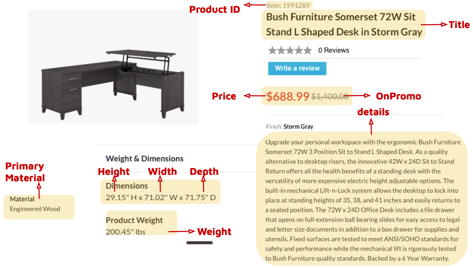
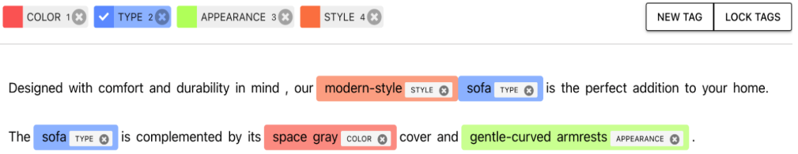
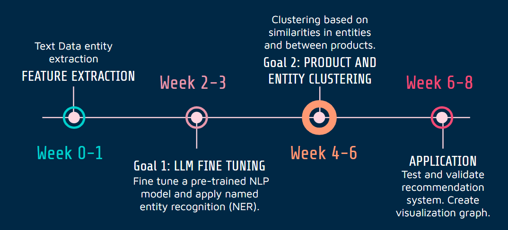

```{r setup, include=FALSE}
knitr::opts_chunk$set(echo = TRUE)
library(knitr)
```

## Executive Summary

Cymax Group Technologies is an eCommerce company that provides furniture vendors and retailers with a software-as-a-service platform. At present, their platforms make use of tabular data associated with furniture items, however, the textual descriptions and images of furniture items contain valuable information that remains untapped despite being readily available. In our Capstone project, we aim to provide Cymax with a solution that can extract meaningful attributes (entities) from product titles and descriptions.

To achieve this, we have been provided with a sample of product descriptions along with other features. Our task is to extract entities from the text data and map these back to the products for use in downstream activities such as identifying similar and complementary products. Our approach involves building a custom named-entity recognition system that can identify relevant entities of furniture items. We will then use these named entities to develop a proof-of-concept application, such as a similarity search engine, to demonstrate the usefulness of these custom entities. Ultimately, the project aims to deliver a refined product entity recognition system for Cymax to enhance their semantic search and product recommendations.

## Introduction

Cymax Group Technologies is an eCommerce company that provides software as a service (SAAS) platforms to furniture vendors and retailers, one of which is Channel Gate. While Cymax currently employs their tabular data to provide analytics on pricing and logistics for each client's products, there is still a lot of untapped information in both the text descriptions and image data of the furniture products. These types of data are useful in understanding the relationship between products, which is a challenge given these products come from different vendors, each having their own distinct furniture taxonomies (different categories or subcategories for the same type of furniture). Furthermore, these relationships would help reveal similar and complementary items, which could be used for downstream applications such as a recommendation system or enhanced search (among other use cases).

For the purposes of our project, we will focus on uncovering useful product information using the text description and product title. This problem is complex and requires the use of data science tools because these text descriptions contain a variety of potentially useful attributes, often dependent on the product of interest. For example, couches might have details on material or fabric which would be missing when describing tables or desks. Secondly, there is also ambiguity in the meaning of a single attribute and semantic context becomes important in understanding what the attribute represents for that particular item (i.e. "orange" could imply color, fruit or scent).

We have broken down our project into two main objectives:

-   **Objective 1**: In order to address the complexities mentioned above, we will focus on how to extract meaningful entities (product attributes) along with their relationship to the product (color, material, furniture type etc.) from each product's description and title. We will use named-entity recognition (NER) for custom tagging.

-   **Objective 2**: Our second objective will be to apply our custom tagging for a single use case - product similarity. We will use the extracted entities as features to analyze product-product similarity.

At the end of the project, we hope to provide our partner with all the documentation, the coded pipeline and optimized models for both objectives.

## Data Science Techniques

### Data

Our dataset encompasses 27,000 rows and 19 columns, with 8.5% null values. Primarily focused on furniture-related product information, the columns are categorized as follows: unique keys (Product ID), text (Title, Details), numerical data (Price, Weight, Width, Height, Depth), and categorical data (Primary Material and Product on Promotion or not). An example of product information is shown below:

```{r figure_1, echo=FALSE, fig.align='center', out.width = '80%', fig.cap="Existing Data from A Sample Item"}

```

Each product in our dataset is categorized into a specific category. For instance, the item depicted in Figure 1 belongs to the category 'sofa sets'. Some commonly occurring categories are Rugs, Wall Art, and Beds. However, since this category column was generated by different vendors and different vendors may name their categories differently, we ended up having over 300+ categories, with over 40% of them containing fewer than 5 products. For example, vendor A may categorize the sofa bed in Figure 1 as "sofa sets" and vendor B may categorize it as "sofa suite". This suggests that we have to carefully choose the number of manually tagged samples such that these tagged samples are well-representative enough. Otherwise, our model might not be able to generalize well enough on rare or unseen categories.

**Objective 1**:

Our first objective is to extract meaningful entities from the product text. To achieve this, the first challenge is to select appropriate tags to use as entities in order to accurately represent the furniture item using the text description. After we reviewed the raw product description texts during our exploratory data analysis (EDA) and referenced Walmart's product knowledge graph [@Deivasigamani2020], we decided upon color, product type, product style and product appearance as our primary tags since most product descriptions contain both concrete and abstract properties of products. We will start with the above 4 tags (color, type, style and appearance) for NER, and later expand to more tags if needed.

At first, we will randomly choose a sample of product items to ensure all the major categories are included and then manually tag all their text descriptions using a NER annotator. Figure 2 below shows an example of manual annotation.

```{r figure_2, echo=FALSE, fig.align='center', out.width = '100%', fig.cap="Manual Annotation of Named Entities"}

```

Then we plan to have an 80:20 train-test split for these tagged samples and use the train set to fine-tune a bidirectional language model such as bidirectional encoder representations from transformers (BERT). We have chosen bidirectional models because it can capture the contextual information from the long product descriptions. Once we have evaluated the effectiveness of our fine-tuned model, we will apply this model to all the remaining text data for entity extraction.

**Objective 2**:

In order to maintain the semantic relationships of the entities, first we would like to explore methods for converting the entities into embeddings. For example, the embeddings of 'blue' and 'navy' should be similar when compared to 'blue' and 'red'. We will explore ways to represent these entities in embeddings such as Doc2Vec [@doc2vec] or relational embeddings [@relation]. We will then apply feature engineering on the existing non-text features as well as the extracted product text embeddings. We will explore models such as KNN with these engineered features as inputs to evaluate the product-product relationship.

In addition, we will repeat the feature engineering and relationship modeling process above using a baseline model. In this model, a direct transformation of the raw textual columns into embeddings will be performed with bidirectional large language models. The baseline approach can then be used to benchmark the performance of the NER embeddings.

### Timeline

Our timeline can be found below, where goals 1 and 2 correspond to objectives 1 and 2 mentioned in the introduction above.

```{r figure_3, echo=FALSE, fig.align='center', out.width = '80%', fig.cap="Project Proposal Timeline"}

```

## References
